# Movie Recommender System
This project is an implementation of a movie recommender system using Python. The system uses a dataset from MovieLens, which includes user ratings for various movies, as well as additional information such as movie genres and user demographic data.

The recommendation system uses various techniques, including bag-of-words similarity, user profile recommendation, clustering-based recommendation, PCA, collaborative filtering with k-nearest neighbor, non-negative matrix factorization, neural network-based rating prediction, regression-based rating prediction, and classification-based rating mode prediction.

## Table of Contents
- [Getting Started](#getting-started)
- [Prerequisites](#prerequisites)
- [Running the Project](#running-the-project)
- [Dataset](#dataset)
- [Project Structure](#project-structure)
- [Project Steps and Methods](#project-steps-and-methods)
- [Recommendation Algorithms](#recommendation-algorithms)
- [Conclusion](#conclusion)
- [License](#license)

## Getting Started
Clone the repository to your local machine to get started.

```shell
git clone https://github.com/your-username/movie-recommender-system
```

## Prerequisites
The project requires the following Python libraries:

re: Regular expression operations
random: Generate random numbers
numpy: Numerical computing library
pandas: Data manipulation and analysis library
seaborn: Statistical data visualization library
matplotlib.pyplot: Plotting library
wordcloud: Generate word clouds
nltk.corpus: Natural Language Toolkit corpus
nltk.stem: Stemming algorithms
nltk.tokenize: Tokenization functions
sklearn: Machine learning library
scipy.sparse: Sparse matrix storage

Install the necessary libraries with:

```shell
pip install -r requirements.txt
```

## Running the Project
After cloning the repository and installing the necessary libraries, run the `main.ipynb` notebook. This will initiate the recommendation process.

## Dataset
The dataset used in this project is the MovieLens dataset. It contains user ratings for different movies, along with additional movie information like genres. The data is divided into two files, movies.csv and ratings.csv, which are loaded and preprocessed at the beginning of the project.

## Project Structure
The project follows the steps below:

- Data Loading and Exploration
- Data Preprocessing
- Exploratory Data Analysis (EDA)
- Data Cleansing
- Examination of Merged Data
- Text Processing and Wordcloud Generation
- Application of Various Recommendation Algorithms
  - Bag-of-Words (BoW) Similarity Recommendation
  - User Profiles Recommendation
  - Clustering-based Recommendation using K-means
  - PCA Application on User Profile Feature Vectors
  - Collaborative Filtering-based Recommender System using K Nearest Neighbor
  - Collaborative Filtering-based Recommender System using Non-negative Matrix Factorization
  - Neural Network-based Recommender System for Rating Prediction
  - Regression-based Rating Score Prediction using Embedding Features
  - Classification-based Rating Mode Prediction using Embedding Features


## Project Steps and Methods

### Load and Explore Data
The load_data and display_dataframe_info functions load and display basic information about the movies.csv and ratings.csv files respectively.

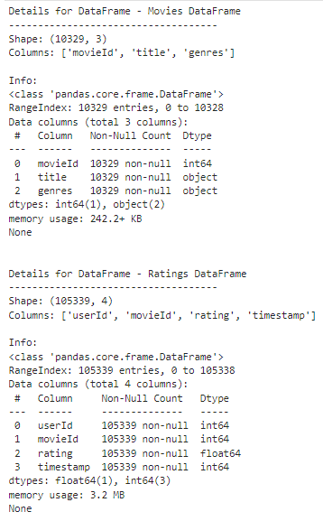

### Preprocess Data
The preprocess_dataframe function performs preprocessing steps on the movie data such as extracting year from the title and binarizing genres.

### Exploratory Data Analysis (EDA)
The script defines a function, `visualize_genre_distribution`, which visualizes the distribution of movie genres using a bar plot. It also prints the number of movies where no genre is listed and the number of movies where IMAX is listed as a genre.

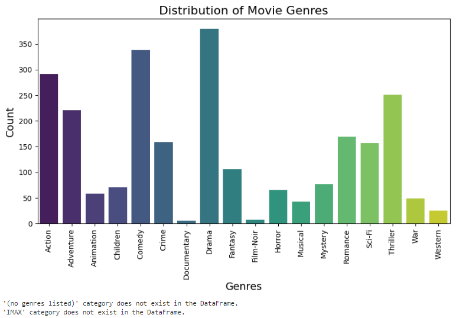

### Data Cleansing
The function `cleanse_dataframes` is defined to perform data cleansing on the movies and ratings dataframes. The cleansing steps include removing entries where no genres are listed, removing the 'IMAX' genre from the genres column, and filtering out movies and users with fewer than a certain number of ratings.

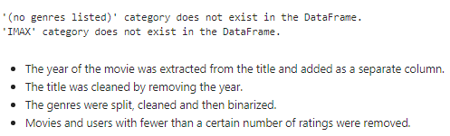
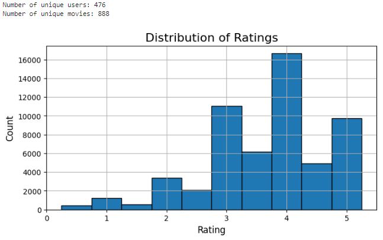
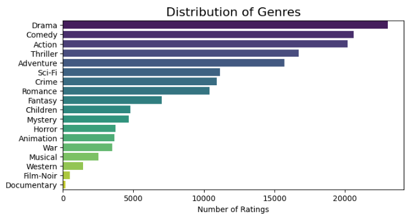

### Explore Merged Data
The explore_merged_data function analyzes the merged dataset, showcasing distribution of ratings, genres and top-rated movies.

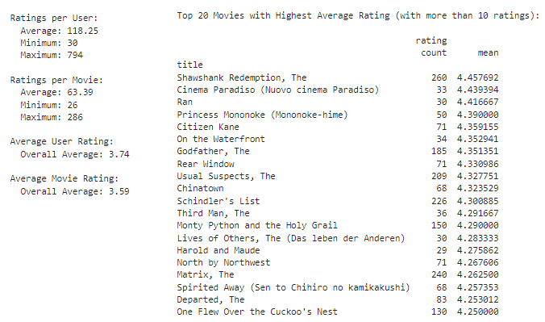

### Text Processing and Wordcloud Generation
The function `process_text` tokenizes, removes stopwords, and lemmatizes input text using the NLTK library. The function `generate_wordcloud` generates and displays a wordcloud from the movie titles in the dataframe, using `process_text` to preprocess the text before generating the wordcloud.

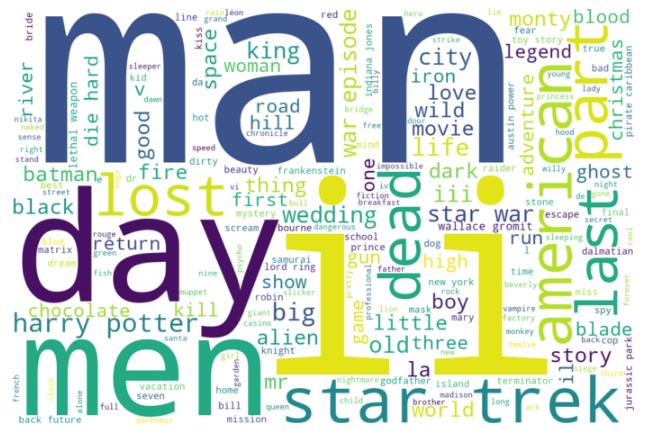

## Recommendation Algorithms
The project utilizes various recommendation algorithms, each explained as follows:

* **Bag-of-Words (BoW) Similarity Recommendation:** 
This approach transforms movie titles and genres into numerical representations. It then calculates a similarity matrix using cosine similarity on the BoW feature vectors.

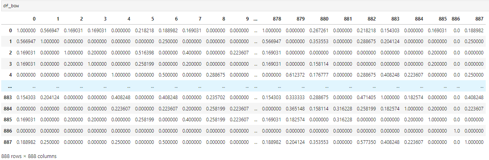

* **User Profiles Recommendation:** 
This method applies Ridge regression to construct user profiles based on movie genres and user ratings.

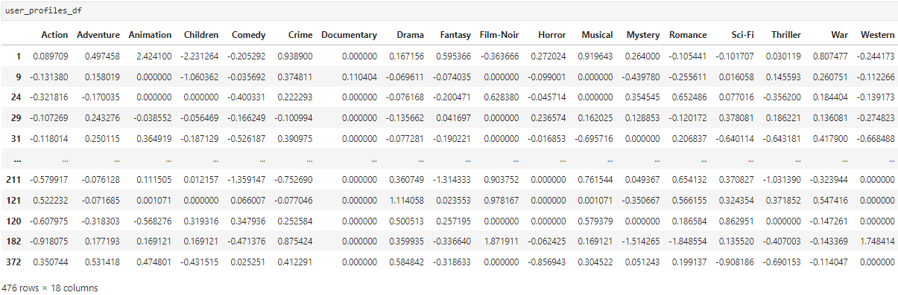

* **Clustering-based Recommendation using K-means:** 
This approach uses K-means clustering to create distinct user clusters based on their preferences (movie ratings, genres). These clusters represent groups of users with similar tastes.

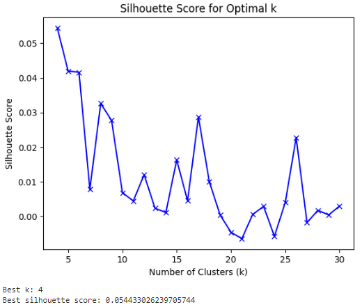

* **PCA Application on User Profile Feature Vectors:** 
This method uses Principal Component Analysis (PCA) to identify the most significant axes in the feature space, helping to remove redundancy in the data and improve efficiency. We then apply K-means clustering on the transformed, lower-dimensional feature vectors.

)

* **Collaborative Filtering-based Recommender System using K Nearest Neighbor:** 
This approach creates a matrix with users as rows, items as columns, and the user's ratings of the items as values. For each user, the system predicts ratings for unrated items based on the ratings of their nearest neighbors.

* **Collaborative Filtering-based Recommender System using Non-negative Matrix Factorization:** 
This method decomposes the user-item matrix into two matrices representing user and item features. Non-negative Matrix Factorization (NMF) can capture complex patterns within the matrix and represent them in a compact, understandable form.

* **Neural Network-based Recommender System for Rating Prediction:** 
This approach involves building a neural network model with user-item interactions as inputs and known ratings as outputs. The trained model can predict the ratings a user would give to an unrated item.

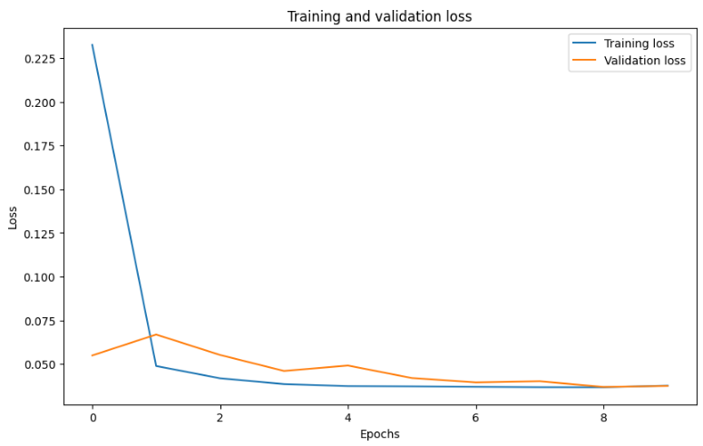

* **Regression-based Rating Score Prediction using Embedding Features:** 
This technique involves training a series of models (Random Forest, Linear Regression, and Gradient Boosting) on extracted user and item embeddings from the previously trained neural network. The best-performing model is chosen based on the R2 score.

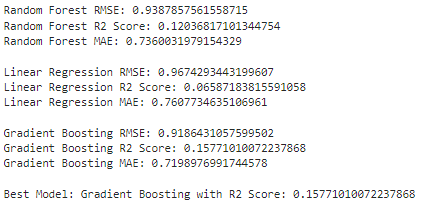

* **Classification-based Rating Mode Prediction using Embedding Features:** 
This approach involves categorizing ratings into discrete classes (e.g., 0.5, 1, 1.5, ..., 5) and training classification models (Random Forest, Logistic Regression) on these categories. The best model is selected based on the F1 score.

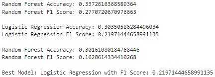

## Conclusion
This project provides an implementation of a movie recommendation system using various techniques. It has demonstrated how different algorithms can lead to diverse recommendation results. While the system performs well, future work could include improving the accuracy of the predictions, incorporating additional data, and exploring more sophisticated recommendation techniques.

## License
This project is licensed under the terms of the MIT license.
See the [LICENSE](LICENSE) file for details.
