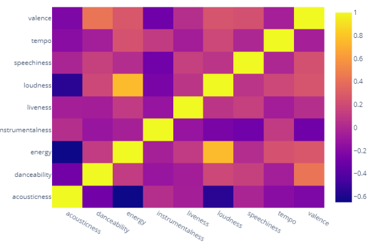
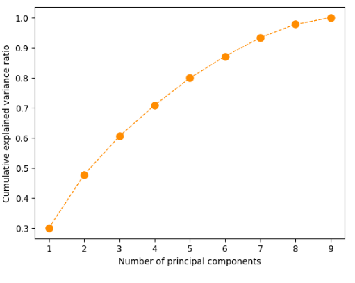
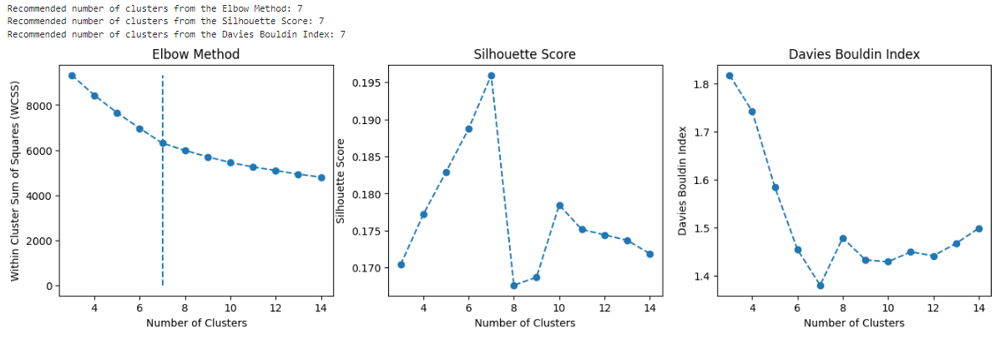
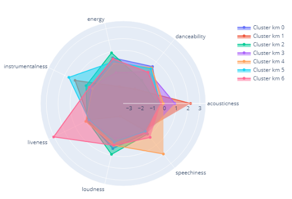
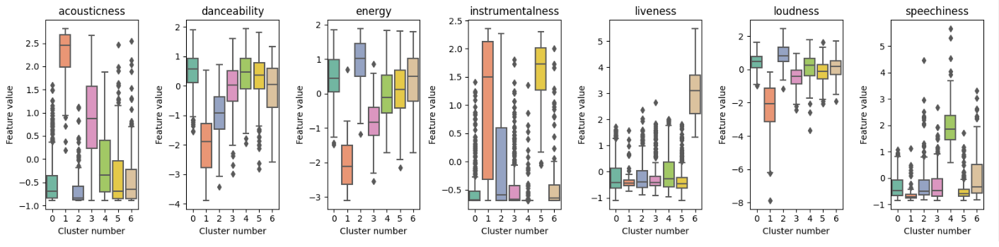
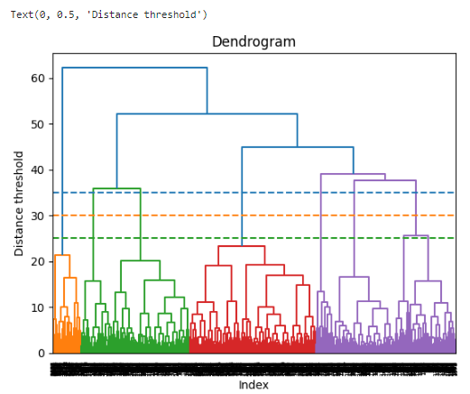
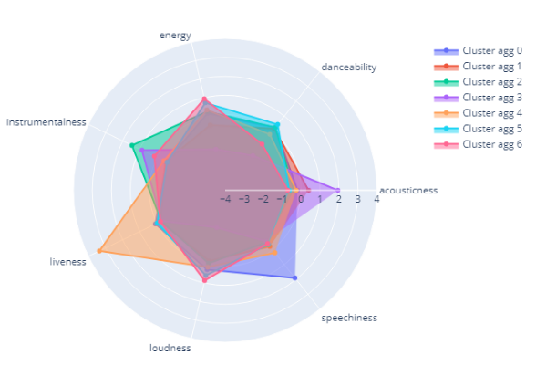
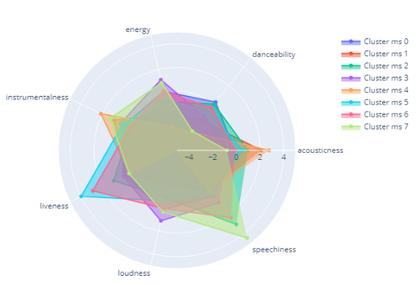
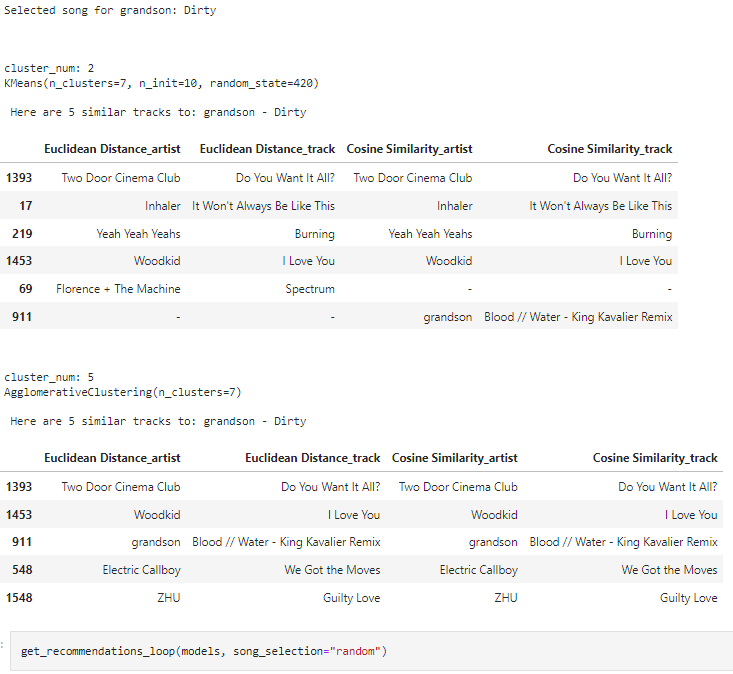

# Spotify Music Clustering

This project aims to create a recommendation system for Spotify songs by using various clustering techniques.

## Table of Contents
1. [Overview](#overview)
2. [Dependencies](#dependencies)
3. [Data Analysis](#data-analysis)
4. [Clustering Models](#clustering-models)
    - [K-Means](#k-means)
    - [Agglomerative Clustering](#agglomerative-clustering)
    - [Mean Shift](#mean-shift)
5. [Recommendation System](#recommendation-system)
6. [Future Steps](#future-steps)

## Overview
The project explores unsupervised learning techniques for clustering songs based on their audio features and uses the clusters to recommend songs. Techniques used include K-Means, Agglomerative Clustering and Mean Shift.

## Dependencies
```python
import pandas as pd
import numpy as np
import matplotlib.pyplot as plt
import seaborn as sns
from sklearn.cluster import KMeans, MeanShift, AgglomerativeClustering
from sklearn.metrics import silhouette_score, davies_bouldin_score
from sklearn.decomposition import PCA
from sklearn.preprocessing import StandardScaler
import pickle
```

## Data Analysis

Data analysis was conducted using a heatmap to visualize the correlation between different audio features of songs.



The Principal Component Analysis (PCA) was used to reduce the dimensionality of the data and explain over 90% of the variance.



## Clustering Models

### K-Means
Identified 7 optimal clusters via the Elbow method, Silhouette score, and Davies Bouldin index.




### Agglomerative Clustering
Similar to K-Means, 7 clusters were chosen based on a dendrogram.



### Mean Shift
This non-parametric clustering algorithm grouped the songs into 8 clusters.


## Recommendation System
A song recommender was created based on the clusters formed by the K-Means and Agglomerative Clustering models. The recommendation was based on Euclidean distance and cosine similarity.


## Future Steps
- Expand song database.
- Develop a web application for song recommendations.
- Implement a function to automatically create Spotify playlists based on the clusters.
